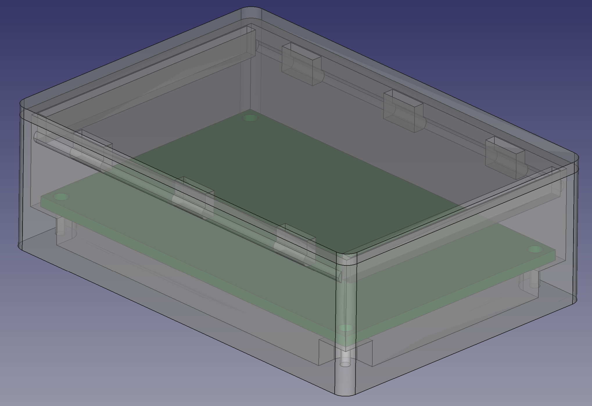
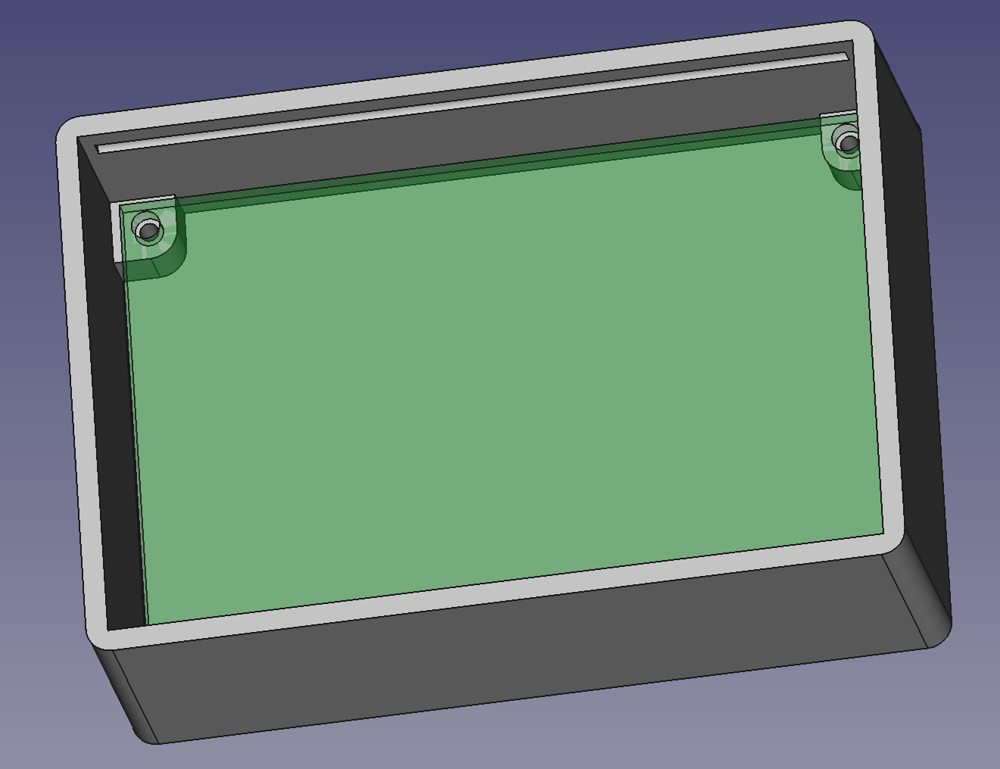
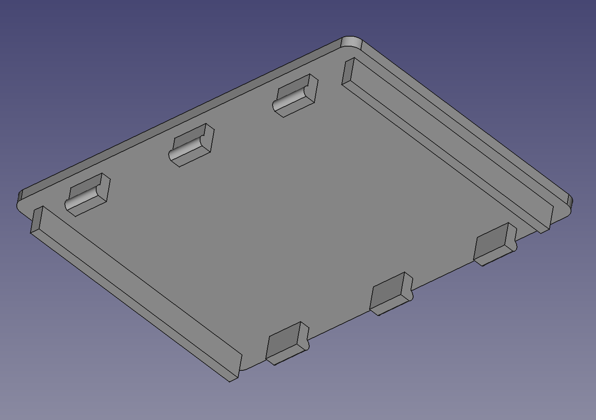

# pcb-enclosure-freecad
Parameterized FreeCAD model for cheap/common PCB perfboard enclosure

A FreeCAD model for commonly available and cheap PCB perfboards such as https://www.amazon.com/dp/B074X2GDH2

Created with FreeCAD 0.19 23578 (Git). Has not been tested with earlier versions.

&copy; 2021 J. L. Cotton joe@lightningflash.net

## Features

* Corner mounting bosses
* Snap-top lid
* Radiused vertical corners

The default size is a 60mm x 40mm board. To adjust for a different board size, open the `box_ss` element in the Spreadsheet and change the `pcb_long` and `pcb_short` values in **Column C**.

## Configuration

The default secondary parameters are what are functional for me, they can be adjusted to suit:

| Secondary Parameter | Description |
|--------------------|-------------|
| `base_thickness` | The thickness of the bottom of the box. Check your slicer settings to find the optimal thickness for the number of layers you desire. |
| `pcb_floor_offset` | The height of the bottom of the PCB from the floor of the box; also the height of the mounting bosses. Make sure this is high enough to accommodate your mounting screw length. |
| `box_outer_height` | Defines the height of the enclosure, as measured from the outside (i.e., including the floor thickness), not including the lid. |
| `wall_thickness` | The vertical wall thickness. Check your slicer settings to find the optimal thickness for the number of layers you desire. |
| `outer_corner_radius` | Radius of the vertical edges for both the box and the lid. |
| `snap_offset` | The height of the snap tabs. i.e., how far into the box do they extend from the lid. |
| `snap_inset` | How far into the box wall the snap tab groove extends. A larger number here will make the lid fit more snugly, but will be harder to remove or risk breaking the snap tabs. |
| `snap_radius` | The snap-tab has a round profile for easier insertion and removal of the lid. This is the radius of that profile. |
| `snap_tolerance` | The difference between the box-wall groove depth and the snap tab. Some clearance helps with removal. |
| `box_flange_thickness` | Only the long side has snap-tabs; the short side has a simple alignment bar; this value defines the thickness of that bar. |
| `lid_tolerance` | Clearance between the short-side alignment bar and the box vertical wall. |
| `pcb_long_holes_edge_distance` | The distance of the PCB mounting hole (center) from the PCB edge along the PCB's long axis. Measurement taken from my 40mm x 60mm sample piece. |
| `pcb_short_holes_edge_distance` | The distance of the PCB mounting hole (center) from the PCB edge along the PCB's long axis. Measurement taken from my 40mm x 60mm sample piece. |

## Pictures

